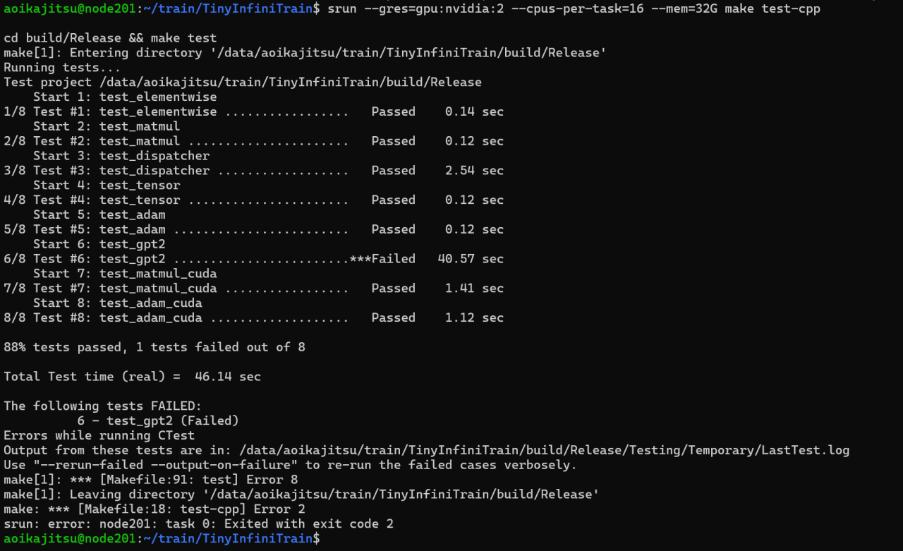
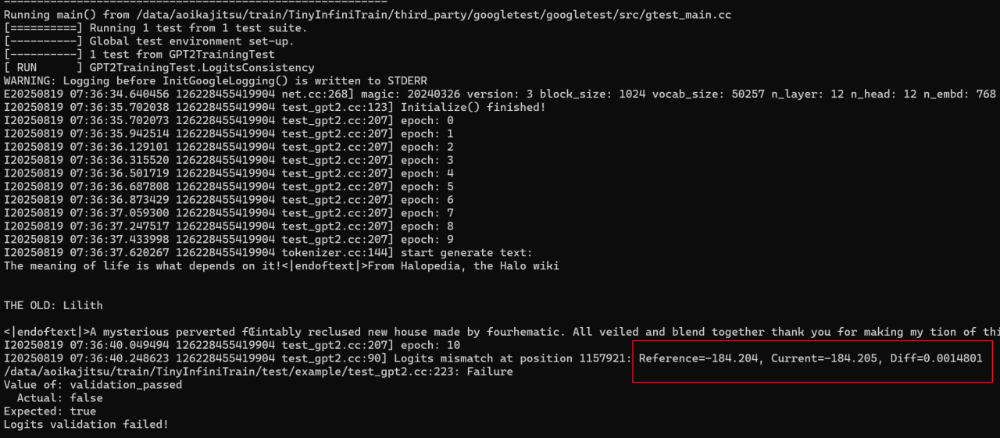

# TinyInfiniTrain 作业报告

## 一、test 通过截图





精度没有通过测试
## 二、作业步骤

> 将代码填入下面代码块中指定位置，并详细描述完成该作业的解决思路和遇到的问题。

### 作业一：autograd机制调用Neg kernel的实现

难度：⭐

对应测例：`TEST(ElementwiseTest, NegForward)`，`TEST(ElementwiseTest, NegBackward)`

需要实现的代码块位置：`infini_train/src/autograd/elementwise.cc`

```c++
std::vector<std::shared_ptr<Tensor>> Neg::Forward(const std::vector<std::shared_ptr<Tensor>> &input_tensors) {
    // =================================== 作业 ===================================
    // TODO：通过Dispatcher获取设备专属kernel，对输入张量进行取反操作
    // HINT: 依赖test_dispatcher，kernel实现已给出
    // =================================== 作业 ===================================
    CHECK_EQ(input_tensors.size(), 1);
    const auto &input = input_tensors[0];

    auto device =input->GetDevice().Type();
    auto kernel = Dispatcher::Instance().GetKernel({device, "NegForward"});
    return {kernel.Call<std::shared_ptr<Tensor>>(input)};

}

std::vector<std::shared_ptr<Tensor>> Neg::Backward(const std::vector<std::shared_ptr<Tensor>> &grad_outputs) {
    // =================================== 作业 ===================================
    // TODO：通过Dispatcher获取设备专属的反向传播kernel，计算梯度
    // HINT: 依赖test_dispatcher，kernel实现已给出
    // =================================== 作业 ===================================
    CHECK_EQ(grad_outputs.size(), 1);
    const auto &grad_output = grad_outputs[0];
    auto device = grad_output->GetDevice().Type();
    auto kernel = Dispatcher::Instance().GetKernel({device, "NegBackward"});
    return {kernel.Call<std::shared_ptr<Tensor>>(grad_output)};

}
```

#### 解决思路

熟悉框架,了解自动微分系统的实现
依据y=-x,∂L/∂x = ∂L/∂y * ∂y/∂x = grad_output * -1
可知Forward和Backward其实都不需要其他额外输入，中间也不需要保存信息

#### 遇到问题
没有问题

### 作业二：实现矩阵乘法

难度：⭐⭐

#### CPU实现

对应测例：`TEST(MatmulTest, BasicMatrixMultiply)`，`TEST(MatmulTest, BatchedMatrixMultiply)`, `TEST(MatmulTest, BackwardPass)`

需要实现的代码块位置：`infini_train/src/kernels/cpu/linear.cc`

```c++
    std::shared_ptr<Tensor> MatmulForward(const std::shared_ptr<Tensor> &input, const std::shared_ptr<Tensor> &other) {
        // =================================== 作业 ===================================
        // TODO：实现CPU上的矩阵乘法前向计算
        // REF:
        // =================================== 作业 ===================================
    const auto &input_dims = input->Dims();
    const auto &other_dims = other->Dims();

    assert(input_dims.size() >= 2 && other_dims.size() >= 2);
    assert(input_dims.size() == other_dims.size());

    const int64_t m = input_dims[input_dims.size() - 2];
    const int64_t k = input_dims[input_dims.size() - 1];
    const int64_t k2 = other_dims[other_dims.size() - 2];
    const int64_t n = other_dims[other_dims.size() - 1];
    assert(k == k2);

    // batch size
    const int64_t bs = std::accumulate(input_dims.begin(), input_dims.end() - 2, 1LL, std::multiplies<int64_t>{});
    for (size_t i = 0; i < input_dims.size() - 2; ++i) {
        assert(input_dims[i] == other_dims[i]);
    }

    std::vector<int64_t> output_dims = input_dims;
    output_dims[output_dims.size() - 1] = n;
    auto output = std::make_shared<Tensor>(output_dims, DataType::kFLOAT32);

    using RowMajorMap = Eigen::Map<Eigen::Matrix<float, Eigen::Dynamic, Eigen::Dynamic, Eigen::RowMajor>>;
    using ConstRowMajorMap = Eigen::Map<const Eigen::Matrix<float, Eigen::Dynamic, Eigen::Dynamic, Eigen::RowMajor>>;

    if (bs == 1) {
        ConstRowMajorMap A(static_cast<const float *>(input->DataPtr()), m, k);
        ConstRowMajorMap B(static_cast<const float *>(other->DataPtr()), k, n);
        RowMajorMap C(static_cast<float *>(output->DataPtr()), m, n);
        C.noalias() = A * B;
    } else {
        for (int64_t b = 0; b < bs; ++b) {
            ConstRowMajorMap A(static_cast<const float *>(input->DataPtr()) + b * m * k, m, k);
            ConstRowMajorMap B(static_cast<const float *>(other->DataPtr()) + b * k * n, k, n);
            RowMajorMap C(static_cast<float *>(output->DataPtr()) + b * m * n, m, n);
            C.noalias() = A * B;
        }
    }

    return output;

    }

    std::tuple<std::shared_ptr<Tensor>, std::shared_ptr<Tensor>>
        MatmulBackward(const std::shared_ptr<Tensor> &input, const std::shared_ptr<Tensor> &other,
                    const std::shared_ptr<Tensor> &grad_output) {
        // =================================== 作业 ===================================
        // TODO：实现CPU上的矩阵乘法反向传播
        // REF:
        // =================================== 作业 ===================================
        // input:  (m, k)
    // other:  (k, n)
    // output: (m, n)  => grad_output 同形状

    const auto in_dims  = input->Dims();
    const auto w_dims   = other->Dims();
    const auto go_dims  = grad_output->Dims();

    CHECK_EQ(in_dims.size(), 2);
    CHECK_EQ(w_dims.size(), 2);
    CHECK_EQ(go_dims.size(), 2);

    const int64_t m = in_dims[0];
    const int64_t k = in_dims[1];
    CHECK_EQ(w_dims[0], k);
    const int64_t n = w_dims[1];

    CHECK_EQ(go_dims[0], m);
    CHECK_EQ(go_dims[1], n);

    std::vector<int64_t> grad_input_dims = {m, k};
    std::vector<int64_t> grad_other_dims = {k, n};

    auto grad_input = std::make_shared<Tensor>(grad_input_dims, DataType::kFLOAT32);
    auto grad_other = std::make_shared<Tensor>(grad_other_dims, DataType::kFLOAT32);

    grad_input->EigenMatrix() =
        grad_output->EigenMatrix() * other->EigenMatrix().transpose();

    grad_other->EigenMatrix() =
        input->EigenMatrix().transpose() * grad_output->EigenMatrix();

    return {grad_input, grad_other};

    }
```

#### CUDA实现

对应测例：`TEST(MatmulTest, BasicMatrixMultiplyCuda)`,`TEST(MatmulTest, BatchedMatrixMultiplyCuda)`,`TEST(MatmulTest, BackwardPassCuda)`

需要实现的代码块位置：`infini_train/src/kernels/cuda/lindear.cu`

```c++
    std::shared_ptr<Tensor> MatmulForward(const std::shared_ptr<Tensor> &input, const std::shared_ptr<Tensor> &other) {
        // =================================== 作业 ===================================
        // TODO：实现CUDA上的矩阵乘法前向计算
        // REF:
        // =================================== 作业 ===================================
    }

    std::tuple<std::shared_ptr<Tensor>, std::shared_ptr<Tensor>>
        MatmulBackward(const std::shared_ptr<Tensor> &input, const std::shared_ptr<Tensor> &other,
                    const std::shared_ptr<Tensor> &grad_output) {
        // =================================== 作业 ===================================
        // TODO：实现CUDA上的矩阵乘法反向传播
        // REF:
        // =================================== 作业 ===================================
    }
```

#### 解决思路

观察到框架已经引入Eigen/CUBLAS，CPU/GPU端实现就直接使用Eigen/CUBLAS了

#### 遇到问题

刚开始的实现不支持更高阶的张量，测试没过就修复了

### 作业三：实现Adam优化器

难度：⭐

#### CPU实现

对应测例：`TEST(AdamOptimizerTest, BasicParameterUpdate)`,`TEST(AdamOptimizerTest, MomentumAccumulation)`

代码位置：infini_train/src/kernels/cpu/accumulate_grad.cc

```c++
void AdamAccumulateGrad(const std::shared_ptr<Tensor> &grad, const std::shared_ptr<Tensor> &param,
                        const std::shared_ptr<Tensor> &m, const std::shared_ptr<Tensor> &v, float learning_rate,
                        float beta1, float beta2, float eps, int64_t t) {
    // =================================== 作业 ===================================
    // TODO：实现Adam优化器的梯度累积和参数更新
    // REF: 
    // =================================== 作业 ===================================
    auto grad_data = static_cast<float*>(grad->DataPtr());
    auto param_data = static_cast<float*>(param->DataPtr());
    auto m_data = static_cast<float*>(m->DataPtr());
    auto v_data = static_cast<float*>(v->DataPtr());

    float beta1_t = std::pow(beta1, t);
    float beta2_t = std::pow(beta2, t);

    for (int64_t idx = 0; idx < grad->NumElements(); ++idx) {
        m_data[idx] = beta1 * m_data[idx] + (1.0f - beta1) * grad_data[idx];
        v_data[idx] = beta2 * v_data[idx] + (1.0f - beta2) * grad_data[idx] * grad_data[idx];
        float m_hat = m_data[idx] / (1.0f - beta1_t);
        float v_hat = v_data[idx] / (1.0f - beta2_t);
        param_data[idx] -= learning_rate * m_hat / (std::sqrt(v_hat) + eps);
    }

}
```

#### CUDA实现

对应测例：`TEST(AdamOptimizerTest, BasicParameterUpdateCuda)`,`TEST(AdamOptimizerTest, MomentumAccumulationCuda)`

代码位置：infini_train/src/kernels/cuda/accumulate_grad.cu

```c++
void AdamAccumulateGrad(const std::shared_ptr<Tensor> &grad, const std::shared_ptr<Tensor> &param,
                        const std::shared_ptr<Tensor> &m, const std::shared_ptr<Tensor> &v, float learning_rate,
                        float beta1, float beta2, float eps, int64_t t) {
    // =================================== 作业 ===================================
    // TODO：实现Adam优化器的梯度累积和参数更新
    // REF: 
    // =================================== 作业 ===================================
    size_t num_elements = gradient->NumElements();

    const float *grad_ptr = static_cast<const float *>(gradient->DataPtr());
    float *tensor_ptr = static_cast<float *>(tensor->DataPtr());

    int threads_per_block = 256;
    int num_blocks = (num_elements + threads_per_block - 1) / threads_per_block;

    AccumulateGradKernel<<<num_blocks, threads_per_block>>>(grad_ptr, rate, tensor_ptr, num_elements);

}
```

#### 解决思路

对着公式算就好了

#### 遇到问题

无

### 作业四：实现Tensor基础操作

#### 实现Tensor的Flatten操作

难度：⭐

对应测例：`TEST(TensorTransformTest, Flatten2DTo1D)`,`TEST(TensorTransformTest, FlattenWithRange) `,`TEST(TensorTransformTest, FlattenNonContiguous)`

代码位置：infini_train/src/tensor.cc

```c++
std::shared_ptr<Tensor> Tensor::Flatten(int64_t start, int64_t end) {
    // =================================== 作业 ===================================
    // TODO：实现张量扁平化操作，将指定维度范围[start, end]内的所有维度合并为一个维度
    // HINT: 
    // =================================== 作业 ===================================
    if (end == -1) end = dims_.size() - 1;
    CHECK_GE(start, 0);
    CHECK_LT(start, dims_.size());
    CHECK_GE(end, start);
    CHECK_LT(end, dims_.size());

    std::vector<int64_t> new_dims;
    int64_t flattened_dim = 1;
    for (int i = 0; i < dims_.size(); ++i) {
        if (i >= start && i <= end) {
            flattened_dim *= dims_[i];
            if (i == end) new_dims.push_back(flattened_dim);
        } else {
            new_dims.push_back(dims_[i]);
        }
    }
    return Contiguous()->View(new_dims);
    
}
```

#### 实现Tensor的反向传播机制

难度：⭐

对应测例：`TEST(TensorAutogradTest, BackwardComputesGradient)`,`TEST(TensorAutogradTest, BackwardWithMultipleOutputs)`

代码位置：infini_train/src/tensor.cc

```c++
void Tensor::Backward(std::shared_ptr<Tensor> gradient, bool retain_graph, bool create_graph) const {
    // =================================== 作业 ===================================
    // TODO：实现自动微分反向传播
    // 功能描述：1. 计算当前张量对叶子节点的梯度    2. 支持多输出场景的梯度累加
    // HINT: 
    // =================================== 作业 ===================================
     if (grad_fn_) {
        if (gradient) {
            CHECK_EQ(static_cast<int>(GetDevice().Type()), static_cast<int>(gradient->GetDevice().Type()));
            CHECK_EQ(dims_.size(), gradient->Dims().size());
            CHECK_EQ(static_cast<int8_t>(dtype_),static_cast<int8_t>(gradient->dtype_));
            for (int i = 0; i< dims_.size(); ++i) {
                CHECK_EQ(dims_[i], gradient->Dims()[i]);
            }
        }else {
            CHECK_EQ(dims_.size(), 0);
            gradient = std::make_shared<Tensor>(std::vector<int64_t>{}, dtype_, GetDevice());
            gradient->Fill<float>(1.0f);
        }
        grad_fn_->BackwardPartial(gradient,output_idx_);
    }

}
```

#### 解决思路

Flatten函数代码处注释第一行就是提示，Contiguous和View其实是一个forward,框架保证张量Slice执行拷贝保证内存连续，所以没什么
Backward函数是反向传播的起点，通过BackwardPartial在计算图上传播，调用处可以在Loss节点，梯度就是标量1（默认）

#### 遇到问题

Backward函数两个布尔类型的参数不明白什么情况，看了下主仓库，表示未实现，自然也就看到了和我不一样的部分，我并没有想过Backward允许被中间节点手动调用（需主动输入梯度），没有领悟到其原本的设计，所以在之前的实现里gradient就是这样尴尬的参数

### 作业五 注册算子kernel的实现

难度：⭐⭐⭐

对应测例：`TEST(DispatcherTest, RegisterAndGetKernel)`,`TEST(DispatcherTest, DuplicateRegistration)`,`TEST(DispatcherTest, GetNonexistentKernel)`

代码位置：infini_train/include/dispatcher.h

```c++
template <typename RetT, class... ArgsT> RetT Call(ArgsT... args) const {
    // =================================== 作业 ===================================
    // TODO：实现通用kernel调用接口
    // 功能描述：将存储的函数指针转换为指定类型并调用
    // HINT: 
    // =================================== 作业 ===================================
     using FuncT = RetT (*)(ArgsT...);
        auto f = reinterpret_cast<FuncT>(func_ptr_);
        return f(std::forward<ArgsT>(args)...);

}

template <typename FuncT> void Register(const KeyT &key, FuncT &&kernel) {
    // =================================== 作业 ===================================
    // TODO：实现kernel注册机制
    // 功能描述：将kernel函数与设备类型、名称绑定
    // =================================== 作业 ===================================
    auto [it, inserted] = key_to_kernel_map_.emplace(key, KernelFunction(std::forward<FuncT>(kernel)));
        CHECK(inserted) << "Kernel already registered: " << key.second
                        << " on device: " << static_cast<int>(key.first);

}

struct KernelRegister {
    KernelRegister(infini_train::DeviceType device, const std::string &name, auto func) {
        infini_train::Dispatcher::Instance().Register({device, name}, func);
    }
};
#define REGISTER_KERNEL(device, kernel_name, kernel_func) \

#define REGISTER_KERNEL(device, kernel_name, kernel_func) \
    // =================================== 作业 ===================================
    // TODO：实现自动注册宏
    // 功能描述：在全局静态区注册kernel，避免显式初始化代码
    // =================================== 作业 ===================================
static KernelRegister _##kernel_name##_reg(device, #kernel_name, kernel_func);

```

#### 解决思路

熟悉框架

#### 遇到问题

不熟悉宏导致一些编译问题，最后写出了正确的宏

### 作业六：实现GPT-2整体训练

难度：⭐⭐⭐⭐

对应测例：`TEST_F(GPT2TrainingTest, LogitsConsistency)`

#### 训练过程logits对比

完成以上所有作业，补齐训练框架的所有实现，理论上`TEST_F(GPT2TrainingTest, LogitsConsistency)`可以通过，在用例中判断比较预置的值和单步正向传播计算结果是否在误差允许范围内相等。

#### 数据读取实现

代码位置：example/common/tiny_shakespeare_dataset.cc

```c++
TinyShakespeareFile ReadTinyShakespeareFile(const std::string &path, size_t sequence_length) {
    /* =================================== 作业 ===================================
       TODO：实现二进制数据集文件解析
       文件格式说明：
    ----------------------------------------------------------------------------------
    | HEADER (1024 bytes)                     | DATA (tokens)                        |
    | magic(4B) | version(4B) | num_toks(4B) | reserved(1012B) | token数据           |
    ----------------------------------------------------------------------------------
       =================================== 作业 =================================== */
     if (!std::filesystem::exists(path)) {
        LOG(FATAL) << "File does not exist: " << path;
    }

    auto file_stream = std::ifstream(path, std::ios::binary);
    CHECK(file_stream.is_open()) << "Failed to open dataset file";

    auto header = std::vector<uint8_t>(1024);
    file_stream.read(reinterpret_cast<char *>(header.data()), header.size());

    auto file_magic = BytesToType<int32_t>(header, 0);
    auto file_version = BytesToType<int32_t>(header, 4);
    auto token_count = BytesToType<int32_t>(header, 8);

    CHECK(kTypeMap.count(file_magic)) << "Unknown file magic code";
    auto token_kind = kTypeMap.at(file_magic);
    auto token_byte_size = kTypeToSize.at(token_kind);

    auto sample_count = token_count / static_cast<int64_t>(sequence_length);
    auto sample_dims = std::vector<int64_t>{sample_count, static_cast<int64_t>(sequence_length)};

    auto dataset_file = TinyShakespeareFile{};
    dataset_file.type = token_kind;
    dataset_file.dims = sample_dims;
    dataset_file.tensor = infini_train::Tensor(sample_dims, DataType::kINT64);
    auto *tensor_ptr = static_cast<int64_t *>(dataset_file.tensor.DataPtr());

    auto total_token_elements = sample_count * sequence_length;

    if (token_kind == TinyShakespeareType::kUINT16) {
        CHECK(sequence_length <= 1024) << "Sequence length exceeds UINT16 max";
        auto raw_tokens = std::vector<uint16_t>(total_token_elements);
        file_stream.read(reinterpret_cast<char *>(raw_tokens.data()), raw_tokens.size() * sizeof(uint16_t));
        for (auto i = 0u; i < raw_tokens.size(); ++i) { tensor_ptr[i] = static_cast<int64_t>(raw_tokens[i]); }
    } else if (token_kind == TinyShakespeareType::kUINT32) {
        CHECK(sequence_length <= 8192) << "Sequence length exceeds UINT32 max";
        auto raw_tokens = std::vector<int32_t>(total_token_elements);
        file_stream.read(reinterpret_cast<char *>(raw_tokens.data()), raw_tokens.size() * sizeof(int32_t));
        for (auto i = 0u; i < raw_tokens.size(); ++i) { tensor_ptr[i] = static_cast<int64_t>(raw_tokens[i]); }
    } else {
        LOG(FATAL) << "Unsupported token type in dataset";
    }

    return dataset_file;

    
}

TinyShakespeareDataset::TinyShakespeareDataset(const std::string &filepath, size_t sequence_length): text_file_(ReadTinyShakespeareFile(filepath, sequence_length)), sequence_length_(sequence_length),
      sequence_size_in_bytes_(sequence_length * sizeof(int64_t)), num_samples_(text_file_.dims[0] - 1) {
    // =================================== 作业 ===================================
    // FINISHED：初始化数据集实例
    // HINT: 调用ReadTinyShakespeareFile加载数据文件
    // =================================== 作业 ===================================
    CHECK_EQ(text_file_.dims[1], sequence_length_);
    CHECK_EQ(static_cast<int>(text_file_.tensor.Dtype()), static_cast<int>(DataType::kINT64));

}
```

#### Tokenizer功能实现

代码位置：example/common/tokenizer.cc

```c++
Tokenizer::Tokenizer(const std::string &filepath) {
    /* ===================================== 作业 =====================================
    TODO：实现Tokenizer二进制文件加载

    文件格式说明：
    ----------------------------------------------------------------------------------
    | HEADER (1024 bytes)                     | VOCAB TABLE                           |
    | magic(4B) | version(4B) | vocab_size(4B) | reserved(1012B) | token词表数据       |
    ----------------------------------------------------------------------------------
    ===================================== 作业 ===================================== */
      if (!std::filesystem::exists(filepath)) {
        LOG(FATAL) << "File does not exist: " << filepath;
    }

    auto file_stream = std::ifstream(filepath, std::ios::binary);
    CHECK(file_stream.is_open()) << "Failed to open file: " << filepath;

    auto header = std::vector<uint8_t>(1024);
    file_stream.read(reinterpret_cast<char*>(header.data()), header.size());

    magic_number_   = BytesToType<uint32_t>(header, 0);
    auto version_num = BytesToType<uint32_t>(header, 4);
    vocab_size_     = BytesToType<uint32_t>(header, 8);

    if (kEotMap.find(magic_number_) == kEotMap.end()) {
        LOG(FATAL) << "Unsupported tokenizer magic number: " << magic_number_;
    }

    eot_token_ = kEotMap.at(magic_number_);

    token_table_.resize(vocab_size_);
    for (auto i = 0; i < vocab_size_; ++i) {
        uint8_t token_len;
        file_stream.read(reinterpret_cast<char*>(&token_len), sizeof(token_len));

        auto buffer = std::vector<char>(token_len);
        file_stream.read(buffer.data(), token_len);

        token_table_[i] = std::string(buffer.data(), token_len);
    }
    for (int i = 0; i < 20; i++) {
        std::cout << "Token[" << i << "] = len=" << (int)token_table_[i].size()
                  << " str=" << token_table_[i] << std::endl;
    }

}
```

```c++
std::string Tokenizer::Decode(uint32_t token_id) const {
    /* ===================================== 作业 =====================================
    TODO：实现token_id到文本的转换
    功能描述：根据token_id返回对应的文本片段
    ===================================== 作业 ===================================== */
    if (token_id >= vocab_size_) {
        return "[ERROR]";
    }
    return token_table_[token_id];;

}
```

```c++
void Tokenizer::GenerateText(infini_train::nn::Module &model, uint32_t batch_size, uint32_t sequence_length,
                             uint32_t text_length, Device device) const {
    /* ...原代码... */
    LOG(INFO) << "start generate text:";
    for (int t = prompt_len; t < text_length; t++) {
        /* ===================================== 作业 =====================================
        TODO：实现单步文本生成逻辑
        HINT：调用model.Forward推理获取logits，根据推理结果进行随机采样，调用Decode获取文本结果
        ===================================== 作业 ===================================== */
        // 上一轮结束后x在CPU上,先转移到设备
        x = std::make_shared<infini_train::Tensor>(x->To(device));
        // (bs, seq_len, vocab_size)
        auto logits = model.Forward({x})[0];
        // (bs, seq_len, vocab_size)
        auto probs_device = nn::function::Softmax(logits, 2);
        auto probs_cpu = std::make_shared<Tensor>(probs_device->To(cpu_device));
        auto probs = static_cast<float *>(probs_cpu->DataPtr()) + (t - 1) * logits->Dims()[2];
        auto coin = RandomF32(kRngState);
         auto next = SampleMult(probs, logits->Dims()[2], coin);
        // host
        x = std::make_shared<infini_train::Tensor>(x->To(cpu_device));
        auto add = static_cast<int64_t *>(x->DataPtr());
        add[t] = next;
        std::cout << Decode(next);
    }
    std::cout << std::endl;
}
```

#### 解决思路

加载文件的相关函数好做，熟悉一下类就好了，GenerateText这个做起来问题比较多，思维上不难，得到logits去softmax然后采样就好了，得到新的token后要修改原张量，所以需要从设备转移到cpu端，不这样也行，那就得调用设备的内存操作函数，为了保证不越界，sequence_length >= text_length + prompt_len

#### 遇到问题

GenerateText这个函数参数接受batch_size,但上面的代码却只把prompt填入了一个batch然后补充eot，这很有问题，这个太困惑了于是去看了原仓库，发现也是这样，而且kRngState使用未定义行为取随机数，跑出来基本都是0,造成生成的文本都只是词表[0]的'!'，于是修正为uint64_t kRngState = std::chrono::steady_clock::now().time_since_epoch().count();，这样就能正常生成文本了
